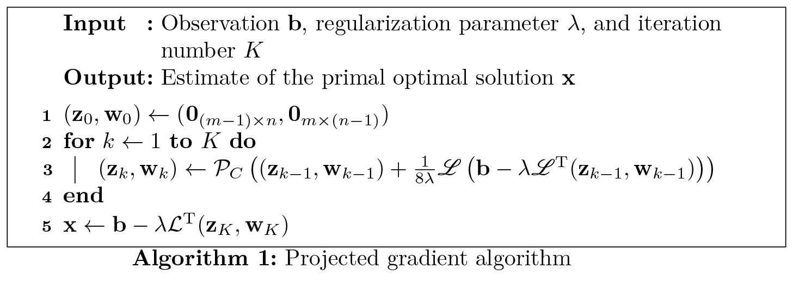
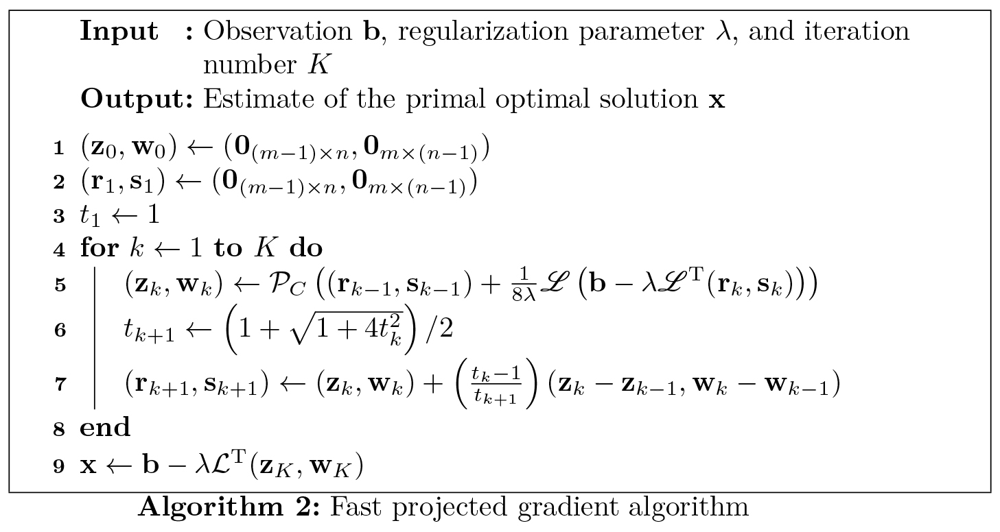

# Total variation based image denoising problems

**Author:** [Yunhui Gao](https://github.com/Yunhui-Gao) (gyh21@mails.tsinghua.edu.cn)

We are concerned with optimization problems of the following form:
$$
\mathop{\mathrm{min}}\limits_{\mathbf{x}} \frac{1}{2}\|\mathbf{x - b}\|_\mathrm{F}^2 + \lambda \left\| \mathbf{x} \right\|_\mathrm{TV},
$$
where $\left\| \cdot \right\|_\mathrm{F}$ stands for the **Frobenius norm**, and $\left\| \cdot \right\|_\mathrm{TV}$ stands for the **total variation (TV) seminorm**.

## Table of contents
- [Preliminaries](#preliminaries)
  - [Notations](#notations)
  - [Convex conjugate](#convex-conjugate)
    - [Definition](#definition)
    - [Properties](#properties)
    - [Examples](#examples)
  - [Dual problem](#dual-problem)
    - [Lagrange duality](#lagrange-duality)
    - [Solving the primal via the dual](#solving-the-primal-via-the-dual)
- [The denoising problem](#the-denoising-problem)
  - [Definition of the TV seminorm](#definition-of-the-tv-seminorm)
  - [Problem formulation](#problem-formulation)
  - [Dual approach](#dual-approach)
  - [Algorithm: the projected gradient method](#algorithm-the-projected-gradient-method)
- [Appendices](#appendices)
    - [Support functions](#support-functions)
    - [Proof of duality](#proof-of-duality)
    - [Proof of optimality](#proof-of-optimality)
    - [Proof of the gradient step size](#proof-of-the-gradient-step-size)
- [References](#references)

## Preliminaries

### Notations

We limit our scope to dealing with the class of **proper, convex, lower-semicontinuous functions** from $\mathbb{R}^d$ to $\left( -\infty, +\infty \right)$, which is denoted as $\Gamma$.

Since we are mainly concerned with images, which are represented by matrices instead of vectors, we use the **Frobenius norm** and **Frobenius inner product** as default operators for $\left\| \cdot \right\|$ and $\left\langle \cdot, \cdot \right\rangle$, respectively.

### Convex conjugate

#### Definition

The **conjugate function** of $f$ is defined as
$$
f^*(\mathbf{x^*}) = \sup\limits_{\mathbf{x}} \left\{ \left\langle \mathbf{x},\mathbf{x^*} \right\rangle - f(\mathbf{x}) \right\}. \tag{1}
$$
**Interpretation:** $f^*$ can be interpreted as an encoding of the convex hull of the function $f$'s epigraph in terms of its supporting hyperplanes.

**Note:** Since we are running out of letters, we apologize for using $\mathbf{x}^*$ to denote the variable for the conjugate function. The superscript $(\cdot)^*$, when applied to a variable, should never be interpreted as the conjugate, though. We hope this does not cause confusion for the reader.

#### Properties

The following are some properties of convex conjugate that are useful to our discussion below.

If $f\in\Gamma$, we have 

- $f^*\in\Gamma$. That is, $f^*$ is also a proper, convex, lower-semicontinuous function.

- $f^{**} = f$. That is, the biconjugate $f^{**}$ (the convex conjugate of the convex conjugate) is equal to $f$.

- $\mathbf{x^*} \in \partial f(\mathbf{x}) \Leftrightarrow \mathbf{x} \in \partial f^* (\mathbf{x^*})$, where $\mathbf{x^*} \in \partial f(\mathbf{x})$ is called the **subgradient** of $f$ at $\mathbf{x}$.

#### Examples

Below are some commonly encountered functions and their corresponding conjugate.

- If $f(\mathbf{x}) = (1/2) \left\| \mathbf{x} \right\|^2$, we have $f^*(\mathbf{x^*}) = (1/2)\left\| \mathbf{x^*} \right\|^2$.

- Suppose $\mathbf{a}$ is a constant matrix. The conjugate of $f(\mathbf{x} + \mathbf{a})$ is $f^*(\mathbf{x^*}) + \left\langle\mathbf{a, x^*}\right\rangle$.

- Suppose $\alpha$ is a scalar in $\left( 0, +\infty \right)$. Then the conjugate of $\alpha f(\mathbf{x})$ is $\alpha f^*(\mathbf{x}^*/\alpha)$.

- Suppose $f$ is the [**support function**](#support-functions) of a closed convex set $C$, i.e., $f(\mathbf{x}) = \sigma_C (\mathbf{x})$. Then $f^*$ is the **indicator function** of $C$, i.e., $f^*(\mathbf{x^*}) = \mathcal{I}_C(\mathbf{x^*})$.

Readers may refer to ref. <a href="#ref-1">1</a> for more examples. 

### Dual problem

#### Lagrange duality

In a broader sense, the denoising problem is an example of a more general class of optimization problems of the form:
$$
\min\limits_{\mathbf{x}} f(\mathbf{x}) + g\left(\mathcal{L}(\mathbf{x})\right), \tag{2}
$$
where $\mathcal{L}(\cdot)$ denotes a linear operator. One can prove (see [Appendices](#proof-of-duality)) that the dual problem can be expressed as
$$
\min\limits_{\mathbf{z}} f^*\left(-\mathcal{L}^\mathrm{T}(\mathbf{z})\right) + g^*\left( \mathbf{z} \right), \tag{3}
$$
where $\mathcal{L}^\mathrm{T}(\cdot)$ is the adjoint operator of $\mathcal{L}(\cdot)$, i.e., $\left\langle \mathbf{z}, \mathcal{L}(\mathbf{x}) \right\rangle = \left\langle \mathcal{L}^\mathrm{T}(\mathbf{z}), \mathbf{x} \right\rangle, \forall \mathbf{x}, \forall \mathbf{z}$.

#### Solving the primal via the dual

For the specific type of problem given by Eq. $(2)$, there is a useful property that states the relation between primal optimal solution and the dual optimal solution. By using the property of the conjugate function, i.e., $g=(g^*)^*$, the primal problem can be reformulated as the following saddle-point problem:
$$
\min\limits_{\mathbf{x}} \max\limits_{\mathbf{z}} f(\mathbf{x}) + \left\langle \mathbf{z}, \mathcal{L}(\mathbf{x}) \right\rangle - g^*(\mathbf{z}). \tag{4}
$$
Suppose the solution is $(\mathbf{x}^\star,\mathbf{z}^\star)$, then we have
$$
-\mathcal{L}^\mathrm{T}(\mathbf{z}^\star) \in \partial f(\mathbf{x}^\star) \quad \mathrm{and} \quad \mathcal{L}(\mathbf{x}^\star) \in \partial g^*(\mathbf{z}^\star). \tag{5}
$$
In fact, one can prove that (see [Appendices](#proof-of-optimality)) when the above conditions are satisfied, $\mathbf{x}^\star$ is a solution to the primal problem, and $\mathbf{z}^\star$ is the solution to the dual problem. Therefore, we obtain the relationship between the primal and dual optimal solutions. When the dual problem is easier to solve than the primal one, as is the case for the denoising problem, we may first derive the dual solution and then convert back to the primal solution.

## The denoising problem

We now come back to the specific problem that we are interested in:
$$
\mathop{\mathrm{min}}\limits_{\mathbf{x}} \frac{1}{2}\|\mathbf{x - b}\|^2 + \lambda \left\| \mathbf{x} \right\|_\mathrm{TV}. \tag{6}
$$

### Definition of the TV seminorm

The TV seminorm can be defined differently, according to the problem. For the **real** case (i.e., $\mathbf{x}, \mathbf{b} \in \mathbb{R}^{m \times n}$), two common choices are the **isotropic TV**:
$$
\begin{aligned}
\left\| \mathbf{x} \right\| _\mathrm{TVi} = &\sum_{i=1}^{m-1} \sum _{j=1}^{n-1} \sqrt{\left( x_{i,j} - x_{i+1,j} \right)^2 + \left( x_{i,j} - x_{i,j+1} \right)^2} \\
& + \sum_{i=1}^{m-1} \left| x_{i,n} - x_{i+1,n} \right| + \sum_{j=1}^{n-1} \left| x_{m,j} - x_{m,j+1} \right|,
\end{aligned} \tag{7}
$$
and the **anisotropic TV**:
$$
\begin{aligned}
\left\| \mathbf{x} \right\| _\mathrm{TVa} = & \sum_{i=1}^{m-1} \sum_{j=1}^{n-1} \left( \left| x_{i,j} - x_{i+1,j} \right| + \left| x_{i,j} - x_{i,j+1} \right| \right) \\
& + \sum_{i=1}^{m-1} \left| x_{i,n} - x_{i+1,n} \right| + \sum_{j=1}^{n-1} \left| x_{m,j} - x_{m,j+1} \right|.
\end{aligned} \tag{8}
$$

### Problem formulation

While there are multiple choices for the TV seminorm, all of them are **not smooth**, and may thus cause difficulties when solving the optimization problem. Here we follow the idea from refs. <a href="#ref-2">2</a> and <a href="#ref-3">3</a>, and adopt a **dual approach**. The following derivation will only consider the case of **isotropic TV**, the corresponding results for the anisotropic TV will be shortly outlined.

Let $\mathbf{u} \in \mathbb{R}^{(m-1) \times n}$ and $\mathbf{v} \in \mathbb{R}^{m \times (n-1)}$ denote the gradients of $\mathbf{x}$ along the vertical and horizontal axis, respectively. That is, we have
$$
\begin{aligned}
& u_{i,j} = x_{i,j} - x_{i+1,j},\quad & &\forall 1\leq i\leq m-1, \forall 1\leq j\leq n \\
& v_{i,j} = x_{i,j} - x_{i,j+1},\quad & &\forall 1\leq i\leq m, \forall 1\leq j\leq n-1.
\end{aligned} \tag{9}
$$

Then the isotropic TV norm can be expressed more compactly as
$$
\begin{align}
\left\| \mathbf{x} \right\|_\mathrm{TVi} &= g(\mathbf{u,v}) \\
&= \sum_{i=1}^{m-1}\sum_{j=1}^{n-1} \sqrt{u_{i,j}^2 + v_{i,j}^2} + \sum_{i=1}^{m-1} \left| u_{i,n} \right| + \sum_{j=1}^{n-1} \left| v_{m,j} \right|. \tag{10}
\end{align}
$$

Then we can see that the denoising problem indeed has the form given by $(2)$, with $f(\mathbf{x}) = 1/(2\lambda)\left\| \mathbf{x} - \mathbf{b} \right\|^2$, $\mathcal{L}(\mathbf{x}) = (\mathbf{u,v})$, and $g(\mathbf{u,v})$ given above. Therefore, we follow the steps in the above section, and solve the problem via the dual.

### Dual approach

To obtain the dual problem, we need to derive the conjugate of $f$ and $g$. The conjugate of $f$ is straightforward according to the above listed examples:
$$
f^*(\mathbf{x^*}) = \frac{1}{2\lambda}\left\| \mathbf{\lambda x^*} \right\|^2 - \left\langle \mathbf{b}, \mathbf{x^*} \right\rangle. \tag{11}
$$

The derivation for the conjugate of $g$ takes a little more effort. Notice that the function $g$ is in fact the support function of $C$, which is a set of matrix pairs $(\mathbf{p,q})$ where $\mathbf{p}\in \mathbb{R}^{(m-1)\times n}$ and $\mathbf{q} \in \mathbb{R}^{m\times (n-1)}$ that satisfy
$$
\begin{aligned}
& p_{i,j}^2 + q_{i,j}^2 \leq 1, & &\forall 1\leq i\leq m-1, \forall 1\leq j\leq n-1, \\
& \left| p_{i,n} \right| \leq 1, & &\forall 1\leq i\leq m-1, \\
& \left| q_{m,j} \right| \leq 1, & &\forall 1\leq j\leq n-1.
\end{aligned} \tag{12}
$$

Therefore, $g^*$ is the indicator function of $C$:
$$
g^*(\mathbf{u^*, v^*}) = \mathcal{I}_C(\mathbf{u^*, v^*}). \tag{13}
$$

According to $(3)$, the dual problem then becomes
$$
\min\limits_{\mathbf{z,w}} \frac{1}{2\lambda} \left\| -\lambda \mathcal{L}^\mathrm{T}(\mathbf{z,w}) \right\|^2 - \left\langle \mathbf{b}, \mathcal{L}^\mathrm{T}(\mathbf{z,w}) \right\rangle + \mathcal{I}_C(\mathbf{z,w}), \tag{14}
$$

where $\mathbf{z} \in \mathbb{R}^{(m-1)\times n}$ and $\mathbf{w}\in \mathbb{R}^{m\times (n-1)}$ are the dual variables. With some algebra, the above formulation can be equivalently expressed as
$$
\min\limits_{(\mathbf{z,w})\in C} \left\{ h(\mathbf{z,w}) \equiv \left\| \mathbf{b} - \lambda \mathcal{L}^\mathrm{T}(\mathbf{z,w}) \right\|^2 \right\}. \tag{15}
$$

For the case of **anisotropic TV**, all the above discussions are valid, except that the set $C$ is defined differently. It contains all matrix pairs $(\mathbf{p,q})$ where $\mathbf{p}\in \mathbb{R}^{(m-1)\times n}$ and $\mathbf{q} \in \mathbb{R}^{m\times (n-1)}$ that satisfy
$$
\begin{aligned}
& \left| p_{i,j} \right| \leq 1, & &\forall 1\leq i\leq m-1, \forall 1\leq j\leq n \\
& \left| q_{i,j} \right| \leq 1, & &\forall 1\leq i \leq m, \forall 1\leq j\leq n-1.
\end{aligned} \tag{16}
$$

Suppose the solution to the above problem is $(\mathbf{z}^\star, \mathbf{w}^\star )$, then according to $(5)$, we have
$$
-\mathcal{L}^\mathrm{T}(\mathbf{z}^\star,\mathbf{w}^\star ) = \frac{1}{\lambda} \left( \mathbf{x}^\star - \mathbf{b} \right). \tag{17}
$$

Thus, we obtain the primal solution as
$$
\mathbf{x}^\star = \mathbf{b} - \lambda \mathcal{L}^\mathrm{T}(\mathbf{z}^\star, \mathbf{w}^\star ). \tag{18}
$$

### Algorithm: the projected gradient method

The dual problem can be solved efficiently using the **projected gradient method**, which proceeds by iteratively updating the gradient of $h$ and the projection onto $C$. 

Note that the objective function $h$ of $(15)$ is continuously differentiable, and the gradient is given by
$$
\nabla h(\mathbf{z,w}) = -2\lambda \mathcal{L}\left( \mathbf{b} - \lambda \mathcal{L}^\mathrm{T}(\mathbf{z,w}) \right). \tag{19}
$$

Furthermore, according to ref. <a href="#ref-3">3</a>, an upper bound exist for the Lipschitz constant of $\nabla h$:
$$
\mathscr{L}(\nabla h) \leq 16 \lambda^2. \tag{20}
$$

We can use the inverse of this upper bound as the gradient step size, which ensures monotone decrease with respect to $h$. See [Appendices](#proof-of-the-gradient-step-size) for proof.

The projection onto the set $C$ can be derived easily. For the isotropic TV, $C$ is defined by $(12)$, and the corresponding projection $(\mathbf{r},\mathbf{s}) = \mathcal{P}_C(\mathbf{z},\mathbf{w})$ is given by

$$
r_{i,j} = \left\{
\begin{aligned}
& \frac{z_{i,j}}{\max \left\{ 1, \sqrt{z_{i,j}^2+w_{i,j}^2} \right\}} & & \forall 1\leq i\leq m-1, \forall 1\leq j\leq n-1 \\
& \frac{z_{i,n}}{\max \left\{ 1, \left| z_{i,n} \right| \right\}}, & & \forall 1\leq i\leq m-1,
\end{aligned}
\right. \tag{21}
$$

and

$$
s_{i,j} = \left\{
\begin{aligned}
& \frac{w_{i,j}}{\max \left\{ 1, \sqrt{z_{i,j}^2+w_{i,j}^2} \right\}} & & \forall 1\leq i\leq m-1, \forall 1\leq j\leq n-1 \\
& \frac{w_{m,j}}{\max \left\{ 1, \left| w_{m,j} \right| \right\}}. & & \forall 1\leq j\leq n-1
\end{aligned}
\right. \tag{22}
$$

For the anisotropic TV, $C$ is defined by $(16)$, and the corresponding projection $(\mathbf{r},\mathbf{s}) = \mathcal{P}_C(\mathbf{z},\mathbf{w})$ is given by

$$
r_{i,j} = \frac{z_{i,j}}{\max \left\{ 1, \left| z_{i,j} \right| \right\}}, \quad \forall 1\leq i\leq m-1, \forall 1\leq j\leq n \tag{23}
$$

and 

$$
s_{i,j} = \frac{w_{i,j}}{\max \left\{ 1, \left| w_{i,j} \right| \right\}}. \quad \forall 1\leq i\leq m, \forall 1\leq j\leq n-1 \tag{24}
$$

Then we obtain the following projection gradient algorithm for solving the dual, and converting to the primal optimal solution.

A faster version was proposed in ref.  <a href="#ref-3">3</a>, as is shown below.

## Appendices

#### Support functions

The **support function** of a set $C \subset \mathbb{R}^d$ is defined as
$$
\sigma_{C}(\mathbf{x^*}) = \sup\limits_{\mathbf{x} \in C} \left\langle \mathbf{x},\mathbf{x^*} \right\rangle. \tag{A.1}
$$

In fact, a function $f$ is the support function of a nonempty closed convex set if and only if $f\in\Gamma$ and it is **positively homogeneous**, i.e., $f(\alpha\mathbf{x}) = \alpha f(\mathbf{x}), \forall \mathbf{x}\in\mathbb{R}^d, \forall \alpha \in \left( 0, +\infty \right)$.

One important example for this is the **norms**. One can easily verify that the **$l_1$ norm** is the support function of the hypercube $\left[ -1,1 \right]^d$, and that the **$l_2$ norm** is the support function of the unit sphere $C=\left\{ \mathbf{x}\in\mathbb{R}^d : \left\| \mathbf{x} \right\| \leq 1 \right\}$.

#### Proof of duality

To obtain the dual problem, we first formulate it as an equivalent constrained optimization problem:
$$
\begin{aligned}
&\min\limits_{\mathbf{x,y}} & &f(\mathbf{x}) + g(\mathbf{y}) \\
&\mathrm{s.t.} & &\mathbf{y} = \mathcal{L}(\mathbf{x}). 
\end{aligned}
\tag{A.2}
$$

Then the Lagrangian is given by
$$
L(\mathbf{x,y,z}) = f(\mathbf{x}) + g(\mathbf{y}) + \left\langle \mathbf{z}, \mathcal{L}(\mathbf{x}) - \mathbf{y} \right\rangle, \tag{A.3}
$$

where $\mathbf{z}$ is the dual variable. The Lagrange dual function, by definition, is
$$
\begin{aligned}
h(\mathbf{z}) &= \inf\limits_{\mathbf{x,y}} L(\mathbf{x,y,z}) \\
&= \inf\limits_{\mathbf{x,y}} \left\{ f(\mathbf{x}) + g(\mathbf{y}) + \left\langle \mathbf{z}, \mathcal{L}(\mathbf{x}) - \mathbf{y} \right\rangle \right\} \\
&= \inf\limits_{\mathbf{x}} \left\{ \left\langle \mathbf{z}, \mathcal{L}(\mathbf{x}) \right\rangle + f(\mathbf{x}) \right\} + \inf\limits_{\mathbf{y}} \left\{ \left\langle \mathbf{z},-\mathbf{y} \right\rangle + g(\mathbf{y}) \right\} \\
&= -\sup\limits_{\mathbf{x}} \left\{ \left\langle \mathbf{z}, - \mathcal{L}(\mathbf{x}) \right\rangle - f(\mathbf{x}) \right\} - \sup\limits_{\mathbf{y}} \left\{ \left\langle \mathbf{z},\mathbf{y} \right\rangle - g(\mathbf{y}) \right\} \\
&= -\sup\limits_{\mathbf{x}} \left\{ \left\langle \mathbf{-\mathcal{L}^\mathrm{T}(z), \mathbf{x}} \right\rangle - f(\mathbf{x}) \right\} - \sup\limits_{\mathbf{y}} \left\{ \left\langle \mathbf{z},\mathbf{y} \right\rangle - g(\mathbf{y}) \right\} \\
&= -f^*\left(-\mathcal{L}^\mathrm{T}(\mathbf{z})\right) - g^*\left( \mathbf{z} \right).
\end{aligned} \tag{A.4}
$$

Thus, the dual problem is
$$
\max\limits_{\mathbf{z}} -f^*\left(-\mathcal{L}^\mathrm{T}(\mathbf{z})\right) - g^*\left( \mathbf{z} \right), \tag{A.5}
$$
which can be equivalently expressed as
$$
\min\limits_{\mathbf{z}} f^*\left(-\mathcal{L}^\mathrm{T}(\mathbf{z})\right) + g^*\left( \mathbf{z} \right). \tag{A.6}
$$

#### Proof of optimality

According to $(5)$ and using the property of conjugate functions, we have
$$
-\mathcal{L}(\mathbf{x}^\star) \in \partial f^*(-\mathcal{L}^\mathrm{T}(\mathbf{z}^\star)) \quad \mathrm{and} \quad \mathcal{L}(\mathbf{x}^\star) \in \partial g^*(\mathbf{z}^\star). \tag{A.7}
$$

Combing the two above formula, we obtain

$$
0 \in \partial \left( f^*(-\mathcal{L}^\mathrm{T}(\mathbf{z}^\star)) + g^*(\mathbf{z}^\star) \right). \tag{A.8}
$$

That is, $\mathbf{z}^\star$ is the dual optimal solution. Similarly, for the primal problem, we have

$$
-\mathcal{L}^\mathrm{T}(\mathbf{z}^\star) \in \partial f(\mathbf{x}^\star) \quad \mathrm{and} \quad \mathcal{L}^\mathrm{T}(\mathbf{z}^\star) \in \partial g(\mathbf{x}^\star), \tag{A.9}
$$

which yields

$$
0 \in \partial \left( f(\mathbf{x}^\star) + g(\mathbf{x}^\star) \right). \tag{A.10}
$$

Thus, $\mathbf{x}^\star$ is the primal optimal solution.

#### Proof of the gradient step size

In this part, we prove the following result.

**Lemma:** For a function $f$ with Lipschitz continuous gradient $\nabla f$ and an upper bound $\mathscr{L}(\nabla f) \leq L$, an update along $-\nabla f$ with a step size of $1/L$ is always non-increasing. That is, we have
$$
f(\mathbf{x} - \frac{1}{L}\nabla f(\mathbf{x})) \leq f(\mathbf{x}). \tag{A.11}
$$

**Proof:** The Taylor expansion (with Lagrange remainder) of $f(\mathbf{x} - L^{-1} \nabla f(\mathbf{x}))$ at $\mathbf{x}$ is given by
$$
f(\mathbf{x} - \frac{1}{L}\nabla f(\mathbf{x})) = f(\mathbf{x}) + \left\langle \nabla f(\mathbf{y}) , -\frac{1}{L} \nabla f(\mathbf{x}) \right\rangle, \tag{A.12}
$$

where
$$
\mathbf{y} = \mathbf{x} - \frac{\theta}{L}\nabla f(\mathbf{x}), \quad \theta \in \left[0, 1\right]. \tag{A.13}
$$

Therefore, proving $(\mathrm{A}.11)$ is equivalent to proving that 
$$
\left\langle \nabla f(\mathbf{y}), \nabla f(\mathbf{x}) \right\rangle \geq 0. \tag{A.14}
$$

The Lipschitz condition on $\nabla f$ suggests that
$$
\left\| \nabla f(\mathbf{y}) - \nabla f(\mathbf{x}) \right\| \leq L \left\| \mathbf{y - x} \right\|  = L \left\| \frac{\theta}{L} \nabla f(\mathbf{x}) \right\|  \leq \left\| \nabla f(\mathbf{x}) \right\|.
\tag{A.15}
$$

Thus we have
$$
\left\langle \nabla f(\mathbf{y}) - \nabla f(\mathbf{x}), \nabla f(\mathbf{y}) - \nabla f(\mathbf{x}) \right\rangle \leq \left\langle \nabla f(\mathbf{x}), \nabla f(\mathbf{x}) \right\rangle, \tag{A.16}
$$

from which we obtain

$$
2 \left\langle \nabla f(\mathbf{y}), \nabla f(\mathbf{x}) \right\rangle \geq \left\| \nabla f(\mathbf{y}) \right\|^2 \geq 0. \tag{A.17}
$$

This completes the proof.

## References

 [1] N. Komodakis and J. Pesquet, "Playing with Duality: An overview of recent primal-dual approaches for solving large-scale optimization problems," IEEE Signal Processing Magazine **32**, 31-54 (2015). [link](https://ieeexplore.ieee.org/document/7298566)

 [2] A. Chambolle, "An Algorithm for Total Variation Minimization and Applications," Journal of Mathematical Imaging and Vision **20**, 89-97 (2004). [link](https://link.springer.com/article/10.1023/B:JMIV.0000011325.36760.1e)

 [3] A. Beck and M. Teboulle, "Fast Gradient-Based Algorithms for Constrained Total Variation Image Denoising and Deblurring Problems," IEEE Transactions on Image Processing **18**, 2419-2434 (2009). [link](https://ieeexplore.ieee.org/document/5173518)